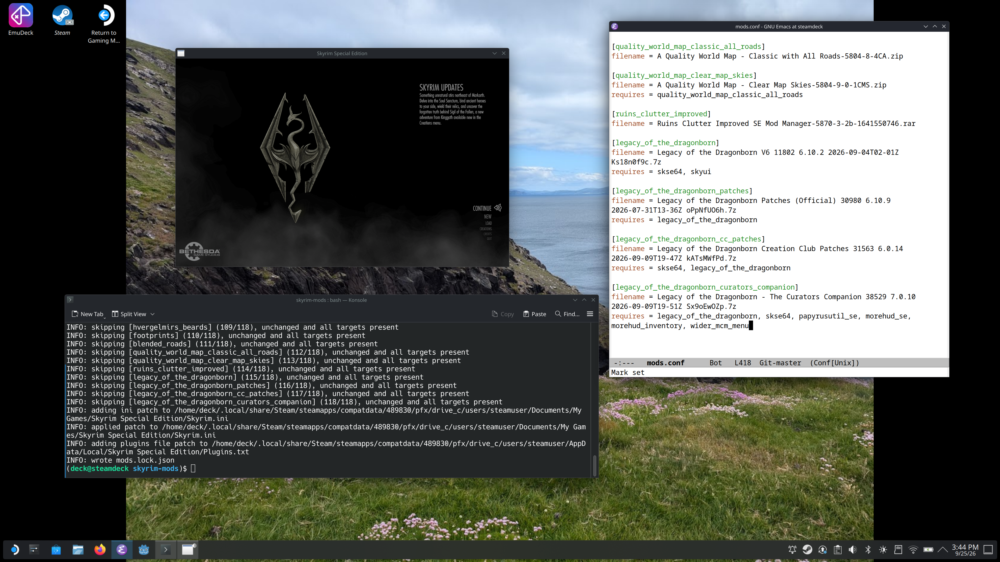
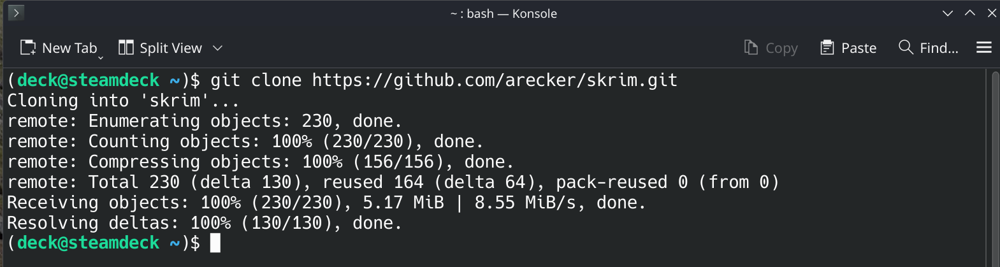

# skrim

Trying to get skyrim working with mods on your steam deck?  Tired of fiddling around with winetricks and laggy windows programs?  I got you.  Use `skrim` to manage your skyrim mods with a simple config file.  Built on the steam deck _for_ the steam deck.

## Features

- **simple**: track load order and dependencies in ini based configuration
- **lightweight**: only python required, terminal based input for interactive installers
- **idempotent**: automatic lock file that tracks every file copied to your game

## Installation

Flip over to the desktop mode on the steam deck and open the Konsole terminal.  Clone this repo.

