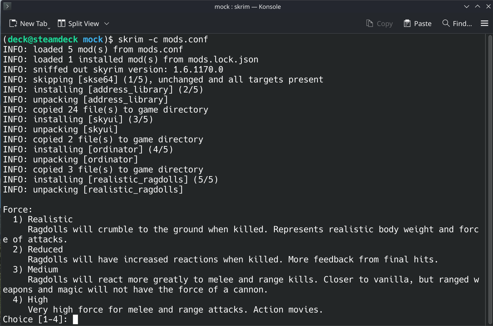

# skrim

Trying to get skyrim working with mods on your steam deck?  Tired of fiddling around with winetricks and laggy windows programs?  I got you.  Use `skrim` to manage your skyrim mods with a simple config file.  Built on the steam deck _for_ the steam deck.

## Features

- **simple**: track load order and dependencies with ini based configuration
- **lightweight**: only python required, terminal based input for interactive installers
- **idempotent**: automatic lock file that tracks every file copied to your game

## Installation

Flip over to the desktop mode on the steam deck and open the Konsole terminal.  Clone this repo.

    git clone https://github.com/arecker/skrim.git

Open a new Konsole terminal in the cloned repo.  Create a virtual environment and install the project.

    python -m venv --copies ./venv
    ./venv/bin/pip install --upgrade --quiet pip
    ./venv/bin/pip install --quiet -e .

Add a new alias to your `.bashrc`

    echo 'alias skrim="path/to/where/you/cloned/skrim/venv/bin/skrim"' > ~/.bashrc

And that's it!  You can now use the `skrim` command to manage your game.

## Usage

Make a new directory for where you will keep your mods.  Create an empty config and a downloads directory.

    mkdir ~/skyrim-mods && cd ~/skyrim-mods
    mkdir downloads
    touch mods.conf

Add a `[skrim]` section to your config.  This is what mine looks like.

    # mods.conf
    [skrim]
    downloads_dir = ./downloads
    game_dir = ~/.local/share/Steam/steamapps/common/Skyrim Special Edition
    plugins_file = ~/.local/share/Steam/steamapps/compatdata/489830/pfx/drive_c/users/steamuser/AppData/Local/Skyrim Special Edition/Plugins.txt
    ini_file = ~/.local/share/Steam/steamapps/compatdata/489830/pfx/drive_c/users/steamuser/Documents/My Games/Skyrim Special Edition/Skyrim.ini

Run the `skrim` tool to validate your setup.

    (deck@steamdeck skyrim-mods)$ skrim -c mods.conf
    INFO: loaded 0 mod(s) from mods.conf
    INFO: loaded 0 installed mod(s) from mods.lock.json
    INFO: sniffed out skyrim version: 1.7.104.0
    INFO: adding ini patch to /home/deck/.local/share/Steam/steamapps/compatdata/489830/pfx/drive_c/users/steamuser/Documents/My Games/Skyrim Special Edition/Skyrim.ini
    INFO: applied patch to /home/deck/.local/share/Steam/steamapps/compatdata/489830/pfx/drive_c/users/steamuser/Documents/My Games/Skyrim Special Edition/Skyrim.ini
    INFO: adding plugins file patch to /home/deck/.local/share/Steam/steamapps/compatdata/489830/pfx/drive_c/users/steamuser/AppData/Local/Skyrim Special Edition/Plugins.txt
    INFO: wrote mods.lock.json

Download a mod from your friendly neighborhood modding website.  The `skrim` tool supports `.zip`, `.7z`, and `.rar`.  Leave the package unopened in the downloads folder referenced in your config.

    skyrim-mods/
    ├── downloads/
    │   └── Skyrim Script Extender (SKSE64) Steam 30379 2.3.1 2026-08-27T16-52Z s6Og0dG94.7z
    └── mods.conf

Then add a new section to your config, naming the section whatever you'd like and pointing `filename` at the package you just downloaded.

    [skse64]
    filename = Skyrim Script Extender (SKSE64) Steam 30379 2.3.1 2026-08-27T16-52Z s6Og0dG94.7z

Run the tool to install it.

    (deck@steamdeck skyrim-mods)$ skrim -c mods.conf
    INFO: loaded 1 mod(s) from mods.conf
    INFO: loaded 0 installed mod(s) from mods.lock.json
    INFO: sniffed out skyrim version: 1.7.104.0
    INFO: installing [skse64] (1/1)
    INFO: unpacking [skse64]
    INFO: copied 127 file(s) to game directory
    INFO: adding ini patch to /home/deck/.local/share/Steam/steamapps/compatdata/489830/pfx/drive_c/users/steamuser/Documents/My Games/Skyrim Special Edition/Skyrim.ini
    INFO: applied patch to /home/deck/.local/share/Steam/steamapps/compatdata/489830/pfx/drive_c/users/steamuser/Documents/My Games/Skyrim Special Edition/Skyrim.ini
    INFO: adding plugins file patch to /home/deck/.local/share/Steam/steamapps/compatdata/489830/pfx/drive_c/users/steamuser/AppData/Local/Skyrim Special Edition/Plugins.txt
    INFO: wrote mods.lock.json

And that's it!

### Interactive Installers

Even interactive installers are supported.  `skrim` will prompt for input right from the terminal and save your answers in the lock file.

### Dependendies

Many mods depend on other mods.  Use `skrim` to track and validate these with a `requires` block in the mod config section.

    skyrim-mods/
    ├── downloads/
    │   ├── Address Library All in One (1.7.104.0) v13 32444 13 2026-08-27T15-29Z Ae46W7Fw2.zip
    │   └── Skyrim Script Extender (SKSE64) Steam 30379 2.3.1 2026-08-27T16-52Z s6Og0dG94.7z
    └── mods.conf

    # mods.conf
    [skse64]
    filename = Skyrim Script Extender (SKSE64) Steam 30379 2.3.1 2026-08-27T16-52Z s6Og0dG94.7z

    [address_library]
    filename = Address Library All in One (1.7.104.0) v13 32444 13 2026-08-27T15-29Z Ae46W7Fw2.zip
    requires = skse64

Run the tool again.  Mods that are already installed (hash in the lockfile matches and all targets are present) are skipped.

    (deck@steamdeck skyrim-mods)$ skrim -c mods.conf
    INFO: loaded 2 mod(s) from mods.conf
    INFO: loaded 1 installed mod(s) from mods.lock.json
    INFO: sniffed out skyrim version: 1.7.104.0
    INFO: skipping [skse64] (1/2), unchanged and all targets present
    INFO: installing [address_library] (2/2)
    INFO: unpacking [address_library]
    INFO: copied 24 file(s) to game directory
    INFO: adding ini patch to /home/deck/.local/share/Steam/steamapps/compatdata/489830/pfx/drive_c/users/steamuser/Documents/My Games/Skyrim Special Edition/Skyrim.ini
    INFO: applied patch to /home/deck/.local/share/Steam/steamapps/compatdata/489830/pfx/drive_c/users/steamuser/Documents/My Games/Skyrim Special Edition/Skyrim.ini
    INFO: adding plugins file patch to /home/deck/.local/share/Steam/steamapps/compatdata/489830/pfx/drive_c/users/steamuser/AppData/Local/Skyrim Special Edition/Plugins.txt
    INFO: wrote mods.lock.json

Update your mods without fear.  Just ownload a newer package and update the `filename` in your config.  That mod (along with all the mods that depend on it) will get reinstalled in the proper order.

    (deck@steamdeck skyrim-mods)$ skrim -c mods.conf
    INFO: loaded 3 mod(s) from mods.conf
    INFO: loaded 3 installed mod(s) from mods.lock.json
    INFO: sniffed out skyrim version: 1.7.104.0
    INFO: skipping [skse64] (1/3), unchanged and all targets present
    INFO: installing [address_library] (2/3)
    INFO: paving [address_library]
    INFO: unpacking [address_library]
    INFO: copied 25 file(s) to game directory
    INFO: reinstalling [papyrusutil_se] (3/3), a required mod was updated
    INFO: unpacking [papyrusutil_se]
    INFO: copied 19 file(s) to game directory
    INFO: adding ini patch to /home/deck/.local/share/Steam/steamapps/compatdata/489830/pfx/drive_c/users/steamuser/Documents/My Games/Skyrim Special Edition/Skyrim.ini
    INFO: applied patch to /home/deck/.local/share/Steam/steamapps/compatdata/489830/pfx/drive_c/users/steamuser/Documents/My Games/Skyrim Special Edition/Skyrim.ini
    INFO: adding plugins file patch to /home/deck/.local/share/Steam/steamapps/compatdata/489830/pfx/drive_c/users/steamuser/AppData/Local/Skyrim Special Edition/Plugins.txt
    INFO: wrote mods.lock.json

Mess up the load order?  No problem - patches are applied in the order they appear in the config, and `skrim` will validate it before touching anything.

    (deck@steamdeck skyrim-mods)$ skrim -c mods.conf
    ERROR: [address_library] requires [skse64], which is listed after it in config

Accidentally remove a mod that another one requires?  That's validated too.

    (deck@steamdeck skyrim-mods)$ skrim -c mods.conf
    ERROR: [sleeping_expanded] requires [dynamic_animation_replacer], which is not in config

### Other Modes

Delete everything and revert the game to it's vanilla state - like Todd Howard intended.

    (deck@steamdeck skyrim-mods)$ skrim -c mods.conf --pave
    INFO: loaded 3 mod(s) from mods.conf
    INFO: loaded 3 installed mod(s) from mods.lock.json
    INFO: sniffed out skyrim version: 1.7.104.0
    INFO: removing ini patch from /home/deck/.local/share/Steam/steamapps/compatdata/489830/pfx/drive_c/users/steamuser/Documents/My Games/Skyrim Special Edition/Skyrim.ini
    INFO: removing plugins file patch from /home/deck/.local/share/Steam/steamapps/compatdata/489830/pfx/drive_c/users/steamuser/AppData/Local/Skyrim Special Edition/Plugins.txt
    INFO: paving [skse64]
    INFO: paving [address_library]
    INFO: paving [papyrusutil_se]

Run `skrim` with verbose logging (warning, it's very verbose).

    (deck@steamdeck skyrim-mods)$ skrim -c mods.conf -v
    DEBUG: starting skrim (python_version = 3.13.15, python_cmd = /home/deck/skrim/venv/bin/python, pwd = /home/deck/skyrim-mods, args = Namespace(config=PosixPath('mods.conf'), pave=False, validate=False, again=False, verbose=True, debug=False))
    INFO: loaded 3 mod(s) from mods.conf
    INFO: loaded 3 installed mod(s) from mods.lock.json

Run `skrim` in a `pdb` session so you can step through the run interactively (only do this if you know what you are doing, you might bork your game).

    (deck@steamdeck skyrim-mods)$ skrim -c mods.conf -d
    INFO: --debug detected, starting pdb session
    > /home/deck/skrim/skrim/__main__.py(34)main()
    -> pdb.set_trace()
    (Pdb)

# Problems

Something broke?  I am not surprised.  I only tested this on [my own modlist](https://www.github.com/arecker/skyrim-mods), so I probably missed something.  Make a github issue and I'd be happy to take a look.
